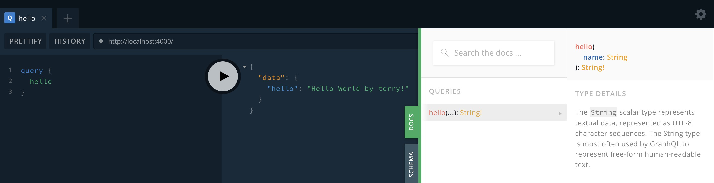

## Install

```bash
# with npm
npm install

# or with Yarn
yarn install
```

## Running
```bash
# 开发
$ npm run dev

# 生产环境运行
$ npm run start
```
## Testing
Open your browser at [http://localhost:4000](http://localhost:4000) and start sending queries.

**Query without `name` argument:**

```graphql
query {
  hello
}
```

The server returns the following response:

```json
{
  "data": {
    "hello": "Hello World  by terry!"
  }
}
```
you can see



## Features

- [x] Babel 7  -- 完成✨✨🎉🎉
- [x] GraphQL -- 完成✨✨🎉🎉
- [x] graphql-yoga -- 完成✨✨🎉🎉
- [ ] mongoose

## Related Projects
